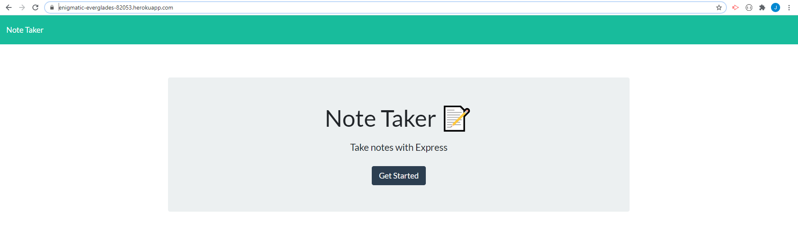
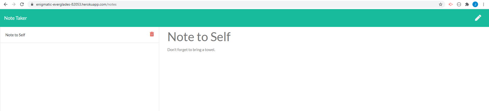

# Note_Taker
[Page Link](https://enigmatic-everglades-82053.herokuapp.com/)

## Description

An Express.js based application that allows a user to add, view, and delete notes via an html interface.  Data is saved on express server as a JSON file. Application has been deployed using Heroku. 

## Table of Contents

* [Usage](#usage-instructions)  
* [Questions](#questions)

## Usage Instructions

* Navigate to main page using this [link](https://enigmatic-everglades-82053.herokuapp.com/)
* Click button in center of screen labeled Get Started.
* Enter note title into label with this title, and Note text in matching area.
* At this point a save icon will appear in the upper right and corner, and should be clicked to add new note to the list. 
* Notes can be viewed by clicking on the Note title in the list to the left of the screen.
* Use the trash can icon to delete notes from the list when they are no longer needed. 
* Pencil icon in top left corner is used to go back to the note taking interface when you are viewing a previous note. 

## Questions

Check out my GitHub page here:  [jeashwor's Page](https://github.com/jeashwor)

If you have additional questions please email me at jeashwor@gmail.com
